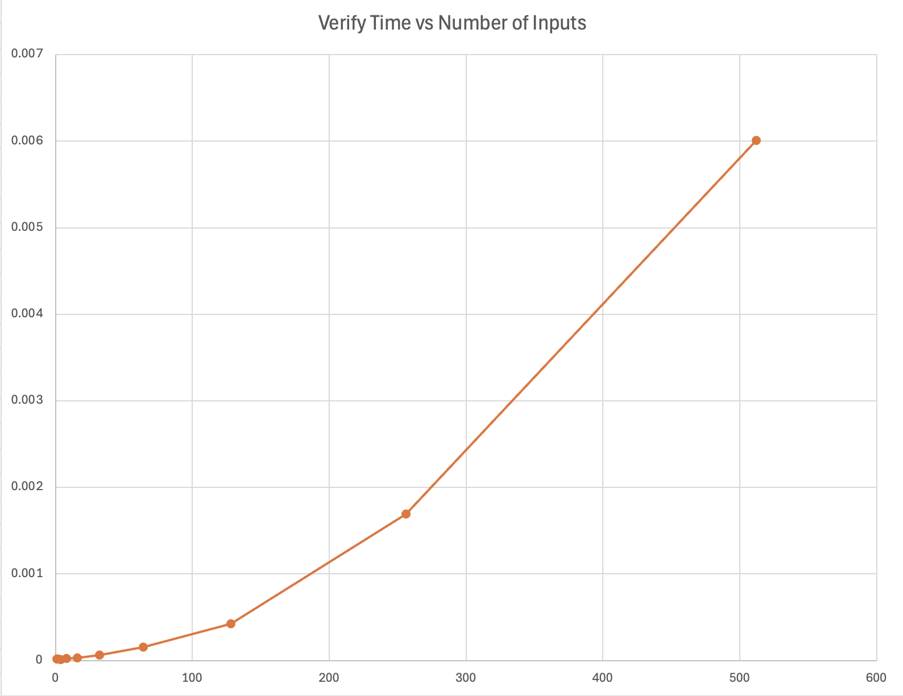

# Stable Matching (Gale-Shapley)

Implementation of the Gale-Shapley algorithm for the hospital-student stable matching problem.

**Authors:** Hari-Krishna Patel (UFID: 89949738), Hunter Stewart (UFID: 43812980)

## Usage

**Linux (bash):**
```bash
python src/main.py match tests/<folder>
python src/main.py match tests/<folder>/<file>.in
python src/main.py verify tests/<folder>
python src/main.py both tests/<folder>
```

**macOS:** Use `python3` instead of `python`:
```bash
python3 src/main.py match tests/<folder>
python3 src/main.py match tests/<folder>/<file>.in
python3 src/main.py verify tests/<folder>
python3 src/main.py both tests/<folder>
```

### Commands

- **match** — Accepts either a folder (which must contain exactly one `.in` file) or a path to a specific `.in` file. Runs the Gale-Shapley algorithm on that input, prints the matching, and writes the result to a `.out` file (same base name as the `.in`, in the same directory). Proposal count and runtime are printed to stderr.

- **verify** — The folder must contain an input and output pair to verify. Either:
  - **Standard:** `verify.in` and `verify.out`, or
  - **Named after folder:** two files that match the folder name (e.g., folder `1` with `1.in` and `1.out`, folder `128` with `128.in` and `128.out`).
  Reads the matching from the `.out` file and checks that it is a valid stable matching for the preferences in the `.in` file. Prints `VALID STABLE` or reports if the matching is invalid.

- **both** — The folder may contain one or more `.in` files. For each `.in` file (in sorted order), runs Gale-Shapley, writes the corresponding `.out` file, and then verifies the matching is stable. Combines match and verify for each input file.

### Clearing output files

To remove all `.out` files from `tests/large_tests`:

```bash
rm tests/large_tests/*.out
```

### Testing large_tests

Run match and verify on every `.in` file in `tests/large_tests`:

```bash
python src/main.py both tests/large_tests
```

### Verifying large_verify_test

The `tests/large_verify_test` folder contains one subfolder per input size (e.g. `1`, `2`, `4`, …, `512`), each with an `.in` and `.out` pair. To verify a single size, run verify on that subfolder:

```bash
python src/main.py verify tests/large_verify_test/1
```

**macOS:** use `python3` instead of `python`.

## Input Format

**Input file type:** Input files must use the **`.in`** extension. The program only processes files ending in `.in` (e.g., `verify.in`, `1.in`, `128.in`). Other file extensions are not accepted.

**Structure:**

```
n
<n lines of hospital preferences>
<n lines of student preferences>
```

See `src/input/example.in` for reference.

## Output

Prints hospital-student pairs (1-indexed). Proposal count and runtime go to stderr.

## Performance

### Match (Gale–Shapley) runtime

Runtime vs. number of inputs (from `tests/large_tests`):


**Analysis:** As the number of inputs increases, runtime of the Gale-Shapely Algorithm (in seconds) increases. The curve is relatively flat for small inputs (e.g., up to ~64) and then steepens for larger inputs (128, 256, 512). So the algorithm takes longer as problem size grows, and the growth in time accelerates at higher input sizes rather than increasing at a constant rate. This non-linear growth is consistent with **O(n²)** time complexity.

### Verify function time

The following graph shows **verify** function time vs. number of inputs:



**Analysis:** The graph plots verify time (in seconds) against the number of inputs. Verify time increases as input size grows: it stays low for small inputs and then rises more sharply for larger ones. This growth is **similar to the Gale–Shapley algorithm**: both exhibit non-linear, accelerating growth as input size increases, consistent with **O(n²)** time complexity.
